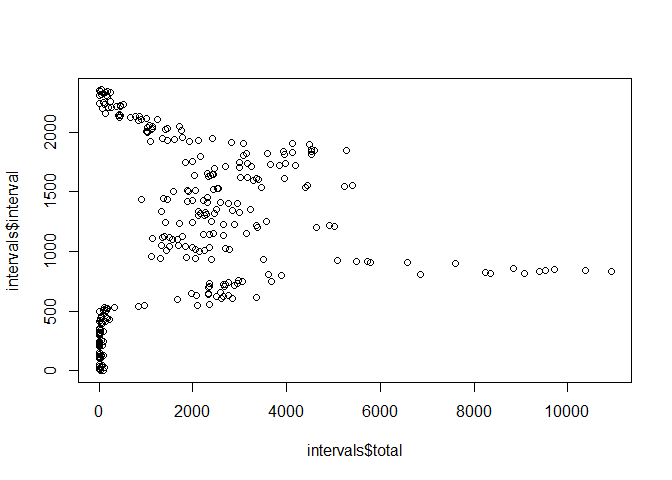
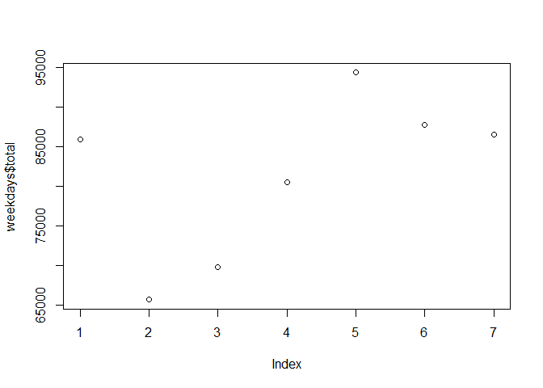

# Reproducible Research: Peer Assessment 1


## Loading and preprocessing the data

```r
activity <- read.csv(unzip("activity.zip"))
str(activity)
```

```
## 'data.frame':	17568 obs. of  3 variables:
##  $ steps   : int  NA NA NA NA NA NA NA NA NA NA ...
##  $ date    : Factor w/ 61 levels "2012-10-01","2012-10-02",..: 1 1 1 1 1 1 1 1 1 1 ...
##  $ interval: int  0 5 10 15 20 25 30 35 40 45 ...
```

```r
activity_nona <- activity[!is.na(activity$steps),]
str(activity_nona)
```

```
## 'data.frame':	15264 obs. of  3 variables:
##  $ steps   : int  0 0 0 0 0 0 0 0 0 0 ...
##  $ date    : Factor w/ 61 levels "2012-10-01","2012-10-02",..: 2 2 2 2 2 2 2 2 2 2 ...
##  $ interval: int  0 5 10 15 20 25 30 35 40 45 ...
```


## What is mean total number of steps taken per day?

```r
library(dplyr)
```

```
## 
## Attaching package: 'dplyr'
## 
## The following object is masked from 'package:stats':
## 
##     filter
## 
## The following objects are masked from 'package:base':
## 
##     intersect, setdiff, setequal, union
```

```r
bydate <- group_by(activity_nona, date)
days <- summarise(bydate, total = sum(steps))
mean_steps_by_date <- mean(days$total)
mean_steps_by_date
```

```
## [1] 10766.19
```


## What is the average daily activity pattern?

```r
byinterval <- group_by(activity_nona, interval)
intervals <- summarise(byinterval, total = sum(steps))
plot(intervals$total,intervals$interval)
```

 


## Imputing missing values


## Are there differences in activity patterns between weekdays and weekends?

```r
byweekday <- group_by(activity_nona, weekdays(as.Date(date)))
weekdays <- summarise(byweekday, total = sum(steps))
plot(weekdays$total,weekdays$interval)
```

 
```
