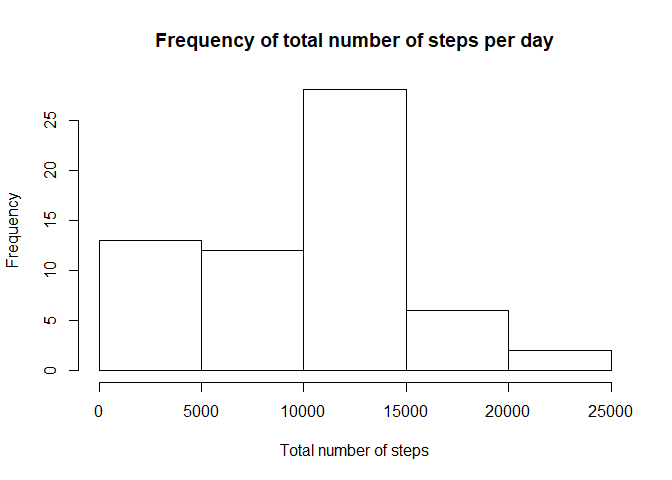
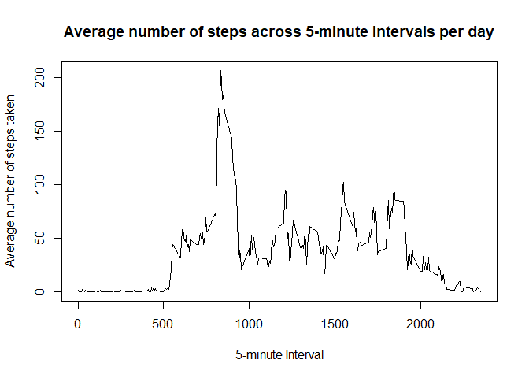
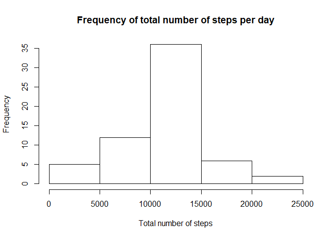
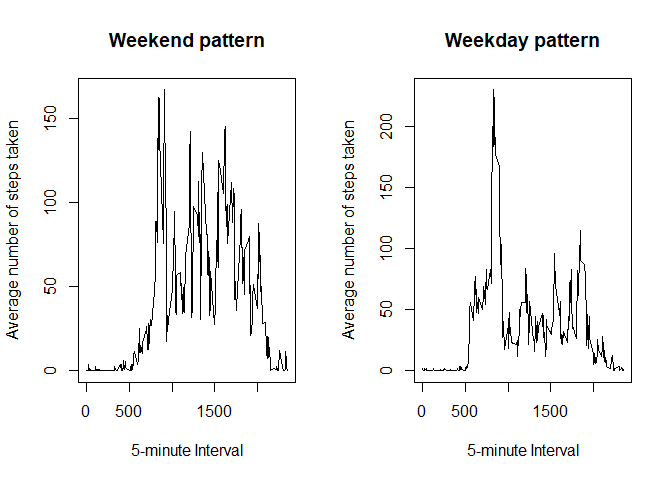

## Loading and preprocessing the data

Need the following libraries. If not installed, install with install.packages().


```r
library(plyr)
```

```
## Warning: package 'plyr' was built under R version 3.6.3
```

```r
library(dplyr)
```

```
## Warning: package 'dplyr' was built under R version 3.6.3
```

```
## 
## Attaching package: 'dplyr'
```

```
## The following objects are masked from 'package:plyr':
## 
##     arrange, count, desc, failwith, id, mutate, rename, summarise,
##     summarize
```

```
## The following objects are masked from 'package:stats':
## 
##     filter, lag
```

```
## The following objects are masked from 'package:base':
## 
##     intersect, setdiff, setequal, union
```

```r
library(chron)
```

```
## Warning: package 'chron' was built under R version 3.6.3
```

```
## NOTE: The default cutoff when expanding a 2-digit year
## to a 4-digit year will change from 30 to 69 by Aug 2020
## (as for Date and POSIXct in base R.)
```

Unzip the file and read the data frame using the default values of read.csv.


```r
activity <- read.csv(unzip("activity.zip"))
str(activity)
```

```
## 'data.frame':	17568 obs. of  3 variables:
##  $ steps   : int  NA NA NA NA NA NA NA NA NA NA ...
##  $ date    : Factor w/ 61 levels "2012-10-01","2012-10-02",..: 1 1 1 1 1 1 1 1 1 1 ...
##  $ interval: int  0 5 10 15 20 25 30 35 40 45 ...
```

Cast dates.


```r
activity$date <- as.Date(activity$date)
```

## What is the mean total number of steps taken per day?

Group data by date and summarize by taking the total number of steps by day.


```r
bydate <- group_by(activity, date)
days <- summarise(bydate, total = sum(steps,na.rm = TRUE))
mean_steps_by_date <- mean(days$total)
mean_steps_by_date
```

```
## [1] 9354.23
```

The mean of the total number of steps taken per day is 37.3825996.
The median of the total number of steps taken per day is 0.


```r
hist(days$total, xlab = "Total number of steps", main = "Frequency of total number of steps per day")
```

<!-- -->


## What is the average daily activity pattern?

Calculate the mean by interval by day and plot the result.


```r
averageStepsByInterval <- tapply(activity$steps, activity$interval, mean, na.rm = TRUE)
plot(names(averageStepsByInterval), averageStepsByInterval, type = "l", xlab = "5-minute Interval", 
     ylab = "Average number of steps taken", main = "Average number of steps across 5-minute intervals per day")
```

<!-- -->

```r
maxIntervalValue <- max(averageStepsByInterval,na.rm = TRUE)
```

The 5-minute interval with the maximum average of the total number of steps taken per day,
206.1698113 , is 835.

## Imputing missing values

The total number of missing values is 2304.

Missing values will be replaced by the mean by interval.


```r
impute.mean <- function(x) replace(x, is.na(x), mean(x, na.rm = TRUE))
data <- ddply(activity, ~ interval, transform, steps = impute.mean(steps))

data <- data[order(data$date), ] #plyr orders by group so we have to reorder
sum(is.na(data$steps))
```

```
## [1] 0
```

```r
head(data)
```

```
##         steps       date interval
## 1   1.7169811 2012-10-01        0
## 62  0.3396226 2012-10-01        5
## 123 0.1320755 2012-10-01       10
## 184 0.1509434 2012-10-01       15
## 245 0.0754717 2012-10-01       20
## 306 2.0943396 2012-10-01       25
```

Repeat previous steps with augmented modified dataset.

Group data by date and summarize by taking the total number of steps by day.


```r
bydate <- group_by(data, date)
days <- summarise(bydate, total = sum(steps))
mean_steps_by_date <- mean(days$total)
mean_steps_by_date
```

```
## [1] 10766.19
```

The mean of the total number of steps taken per day is 37.3825996.
The median of the total number of steps taken per day is 0.

Values do not seem to differ from the original values that ignored the NA entries.


```r
hist(days$total, xlab = "Total number of steps", main = "Frequency of total number of steps per day")
```

<!-- -->


## Are there differences in activity patterns between weekdays and weekends?

Sumarize steps by type of day (weekday vs weekend) and plot the results.


```r
par(mfrow = c(1, 2))

weekend <- data[which(is.weekend(data$date)),]
averageWeekend <- tapply(weekend$steps, weekend$interval, mean, na.rm = TRUE)
plot(names(averageWeekend), averageWeekend, type = "l", xlab = "5-minute Interval", 
     ylab = "Average number of steps taken", main = "Weekend pattern")

weekdays <- data[which(!is.weekend(data$date)),]
averageWeekDays<- tapply(weekdays$steps, weekdays$interval, mean, na.rm = TRUE)
plot(names(averageWeekDays), averageWeekDays, type = "l", xlab = "5-minute Interval", 
     ylab = "Average number of steps taken", main = "Weekday pattern")
```

<!-- -->

